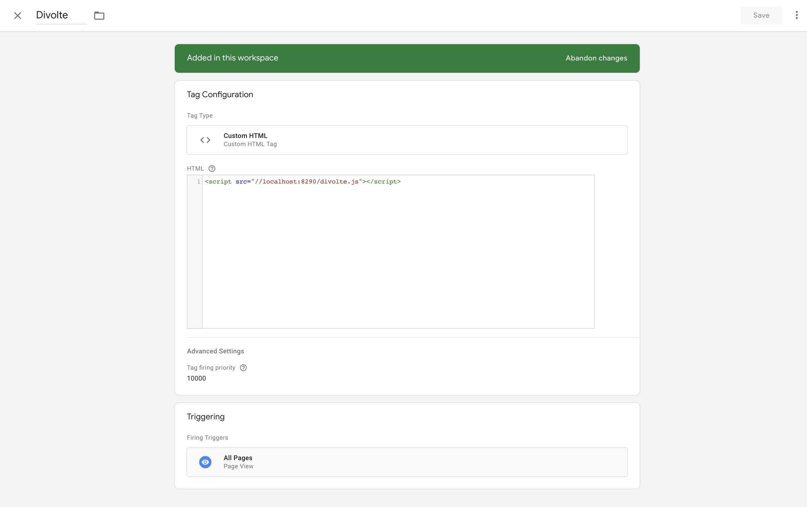
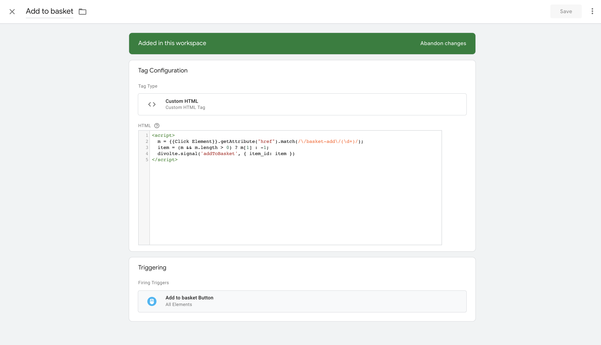
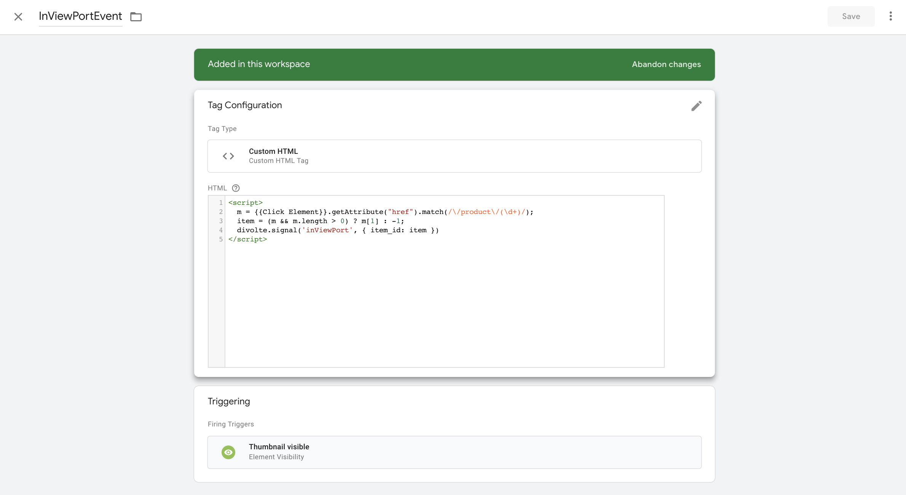
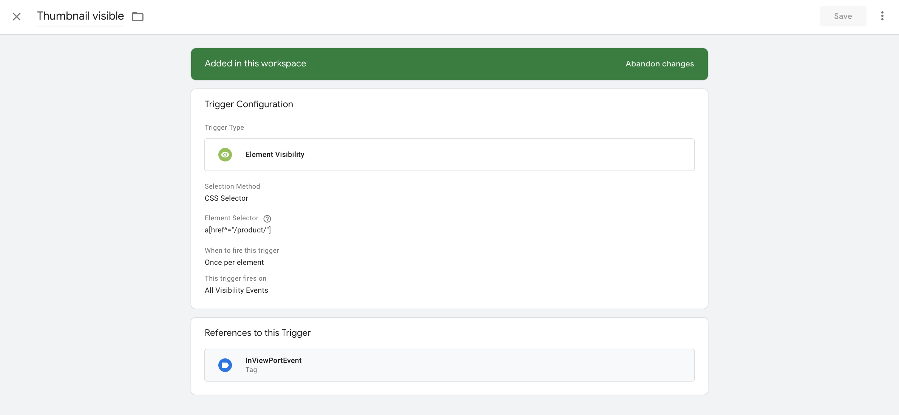

## Integrating with Google Tagmanager

This document describes possible ways to integrate divolte in your site with [google tagmanager](https://tagmanager.google.com/)

As an example website we use the Divolte shop project to describe the changes needed and how to define your tagmanager tags and triggers.

## First things first

to describe possible ways to change the site to work with google tagmanager we first need to give a basic notion on how the divolte clickstream collector is currently integrated in the site.

### Current implementation

The current implementation of our website is a [tornado](https://www.tornadoweb.org/en/stable/) based web application where we use [templates](https://www.tornadoweb.org/en/stable/guide/templates.html) to generate the html pages

#### Pageview events
Inside the base template divolte is incorporated by adding this simple peace of javascript code to the head of the page

```javascript
<script src="{{ config.DIVOLTE_URL }}"></script>
```
which translates in the final html page to

```html
<script src="//localhost:8290/divolte.js"></script>
```
The default behavior of divolte is to send a `pageView` event when this script is loaded

|    timestamp|eventType|pageType|productId|category|
|-------------|---------|--------|---------|--------|
|1549630785595| pageView|category|     null| flowers|


#### Add to basket events
On the product page we call a javascript function to add the product to the shopping basket on a click on the `Add to basket` button. Side effect of this javascript function is that it sends a custom divolte event with the `divolte.signal` function

```html
<button class="btn" onclick="addToBasket({{ item['id'] }})">Add to basket</button>
```

```javascript
function addToBasket(id) {
  $.post('/basket/', { action: 'add', item_id: id }, function() {
      divolte.signal('addToBasket', { item_id: id })
  }).fail(function() {
    alert('BROKEN!')
  })
}
```
Which results in a addToBasket event like this:

|    timestamp|eventType|pageType|  productId|category|
|-------------|---------|--------|-----------|--------|
|1549630786595| pageView|category|10327726993| flowers|


### Implementation with Google Tagmanager

#### The pageview event
First start with the simplest eventtype: the pageview

We need to replace the default injection of the divolte javascript by the injection of the google tagmanager script.

```html
<!--
  	Remove direct injection of the divolte js.
   	<script src="{{ config.DIVOLTE_URL }}"></script>
-->
<!-- Google Tag Manager -->
<script>
	(function(w,d,s,l,i){
	  w[l]=w[l]||[];
	  w[l].push({'gtm.start': new Date().getTime(),event:'gtm.js'});
	  var f=d.getElementsByTagName(s)[0],
         j=d.createElement(s),
         dl=l!='dataLayer'?'&l='+l:'';
     j.async=true;
     j.src='https://www.googletagmanager.com/gtm.js?id='+i+dl;
     f.parentNode.insertBefore(j,f);
    })
    (window,document,'script','dataLayer','GTM-.....');
</script>
<!-- End Google Tag Manager -->
```

Inside google tagmanager we need to define a new tag. This would look something like this:

A `Custom HTML` tag with a default `Page View` trigger. We set the priority of this tag to a really high number to make sure this is fired before other tags. The firing of this tag makes  the divolte javascript variable available which we will use in other custom tags so we need this to be execute before all others.

#### The add to basket event

The add to basket event involves slightly more effort because we need this one to fire only on a click of the add to basket  button and we need to send our product id together with the custom event.

We remove the calling of the custom event from the addToBasket function first.

```javascript
function addToBasket(id) {
  $.post('/basket/', { action: 'add', item_id: id })
}
```

And in google tagmanager we add a new tag:


And the accompanying trigger
![Tagmanger Add to Basket trigger]
(./divolte-add-to-basket-trigger.png)

The tag is again a `Custom HTML` tag where inside the javascript we perform some magic to get the product id from the href element.

```javascript
# the magic
m = {{Click Element}}.getAttribute("href").match(/\/basket-add\/(\d+)/);
item = (m && m.length > 0) ? m[1] : -1;
divolte.signal('addToBasket', { item_id: item })
```

The trigger is a Click All Elements type (because the element we want to capture is a button) where we use the `button[href^="/basket-add"]` `Match CSS Selector` to only fire on the correct button clicks.

### Next steps

That's it for the migration of our 2 eventtypes. Now it is pretty easy to add more events with Google Tagmanager so let me show you the following example.
We add a new event on the product list page to send divolte a custom event when a product comes into the viewport. 






The tag is again a `Custom HTML` tag where inside the javascript we again perform some magic to get the product id from the href element.

The trigger is a `Element Visibility` type where we use the `a[href^="/product/"]` `Element Selector` to fire once if the element becomes visible.

